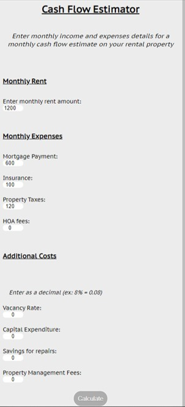
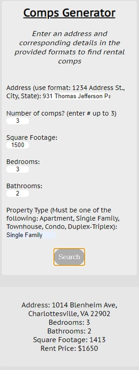
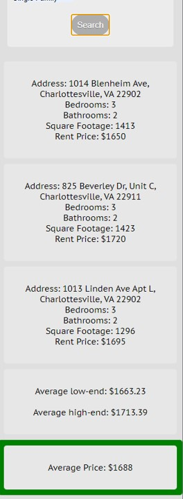
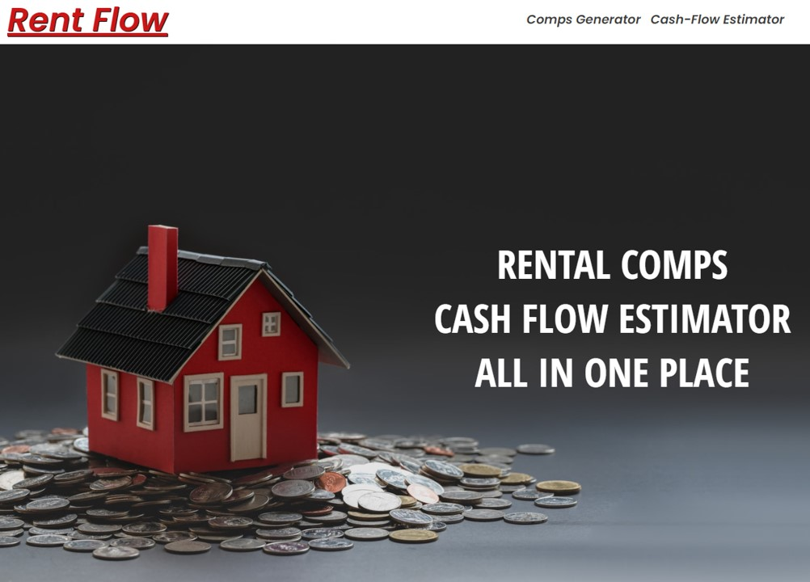
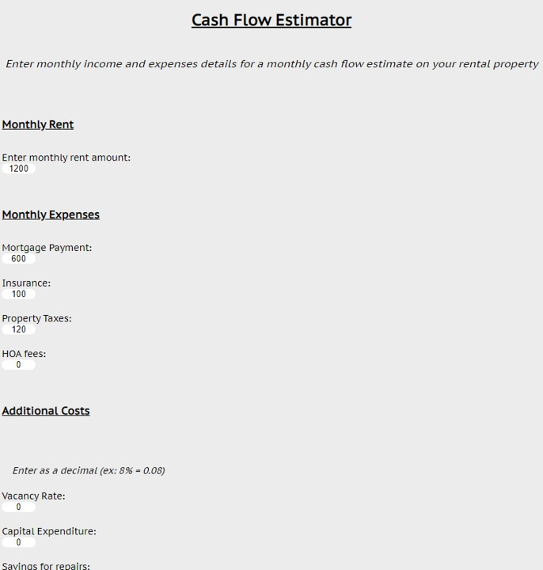
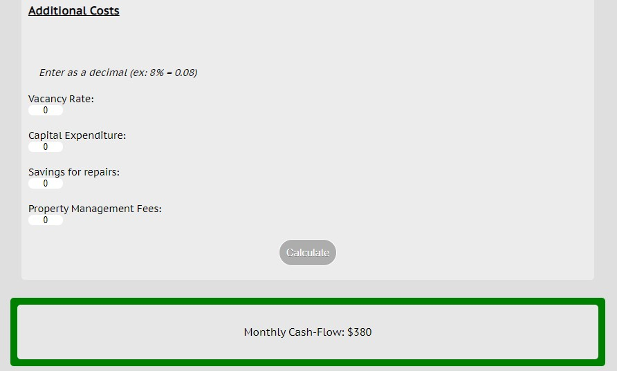

# Rent-Flow
Rent-flow provides users the ability to search for rental property comps in relation to a specified address. Users can then use the monthly cash-flow calculator to determine their expected profits.

# Link
https://dvanpelt-hub.github.io/Rent-Flow/
# Technology
HTML
 
CSS
 
JavaScript
 
jQuery
 
API - rapidAPI/realtymole
 

# Screenshots

# Mobile First layout

# Desktop view

